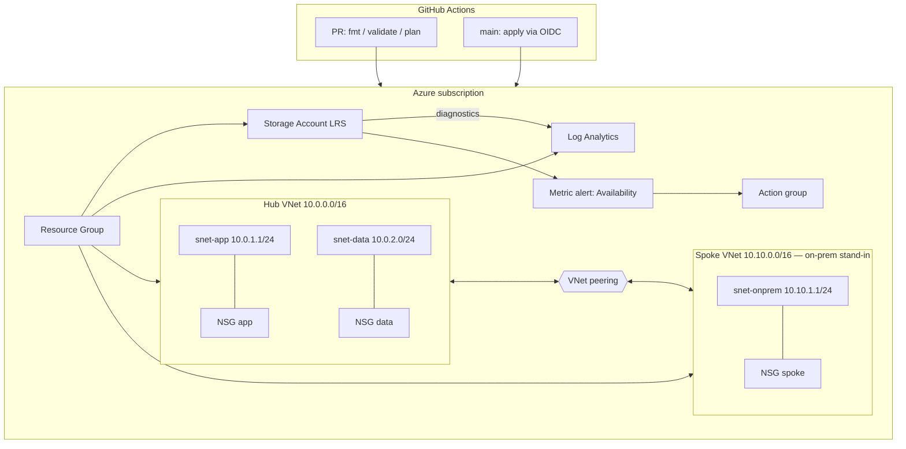

# azure-landing-zone-starter

Free-tier-friendly Azure landing zone starter in Terraform: hub/spoke networking, NSGs, storage lifecycle, Log Analytics, a metric alert, and GitHub Actions plan/apply.

[](LICENSE)
[](https://github.com/jeremylongshore/azure-landing-zone-starter/actions/workflows/ci.yml)
[](https://www.terraform.io)
[](https://registry.terraform.io/providers/hashicorp/azurerm/latest)

This validates that Terraform IaC patterns (modules, state discipline, CI plan/apply, monitoring as code) transfer cleanly from GCP production work to Azure.

## What this demonstrates

| Platform / ops domain | How this repo covers it |
|-----------------------|-------------------------|
| Platform deployment | Resource group + modular stack under `modules/` |
| Infrastructure automation | Terraform + GitHub Actions (`plan` on PR, `apply` on `main`) |
| Environment administration | `environment` = `dev` \| `test` \| `prod` naming + tfvars |
| Connectivity | Hub VNet (app + data) peered to a spoke VNet (**on-prem stand-in**; ExpressRoute/VPN Gateway omitted — not free-tier) |
| Monitoring & operations | Log Analytics, diagnostic settings, metric alert + action group |
| Backup & recovery | Blob versioning, soft-delete (7d), lifecycle policy (cool/archive/delete) |
| Operational readiness | [`runbook.md`](runbook.md) for the storage availability alert |

Not a full Microsoft CAF enterprise-scale landing zone. It is a readable starter an engineer can `plan` in one sitting.

## Architecture



**NSG posture (not wide open):**

- **App:** allow TCP 80/443 **only from spoke subnet**; deny Internet inbound
- **Data:** allow TCP 5432/1433 **only from app subnet**; deny spoke → data; deny Internet inbound
- **Spoke:** allow outbound HTTPS to app; deny outbound to data

## Layout

```
.
├── main.tf / variables.tf / outputs.tf / providers.tf / versions.tf
├── modules/
│   ├── network/       # hub + spoke VNets, subnets, NSGs, peering
│   ├── storage/       # account, container, soft-delete, versioning, lifecycle
│   └── monitoring/    # Log Analytics, diagnostics, action group, metric alert
├── terraform.tfvars.example
├── runbook.md
├── .github/workflows/
│   ├── ci.yml         # fmt + validate (no Azure creds required)
│   ├── terraform.yml  # plan/apply when OIDC secrets present
│   └── release.yml
└── 000-docs/          # enterprise planning set
```

## Prerequisites

- Terraform `>= 1.5`
- Azure subscription (Contributor on a sandbox sub or RG)
- Azure CLI optional for local auth (`az login`)
- For CI apply: GitHub secrets (see below)

## Local deploy

```bash
git clone https://github.com/jeremylongshore/azure-landing-zone-starter.git
cd azure-landing-zone-starter

cp terraform.tfvars.example terraform.tfvars
# edit subscription_id (required), alert_email, environment

az login   # or set ARM_* env vars
terraform init
terraform plan
terraform apply
```

Destroy when done (this is a portfolio sandbox pattern):

```bash
terraform destroy
```

## CI/CD

| Workflow | Trigger | Behavior |
|----------|---------|----------|
| `ci.yml` | every PR / push to `main` | `terraform fmt -check`, `init -backend=false`, `validate` |
| `terraform.yml` | PR / `main` (path-filtered) | same validate job; **plan** and **apply** only if Azure secrets exist |
| `release.yml` | push to `main` / manual | tag + GitHub Release |

### Auth: OIDC (recommended)

GitHub secrets:

| Secret | Value |
|--------|--------|
| `AZURE_CLIENT_ID` | App registration (client) ID |
| `AZURE_TENANT_ID` | Entra tenant ID |
| `AZURE_SUBSCRIPTION_ID` | Target subscription |

Azure side: create an App registration, add a **federated credential** for:

- `repo:jeremylongshore/azure-landing-zone-starter:ref:refs/heads/main`
- `repo:jeremylongshore/azure-landing-zone-starter:pull_request`

Grant the app **Contributor** on the sandbox subscription (or a dedicated RG). Workflow uses `azure/login@v2` with OIDC (`id-token: write`).

### Auth: service principal (alternative)

Documented as commented steps in [`.github/workflows/terraform.yml`](.github/workflows/terraform.yml):

1. Create SP: `az ad sp create-for-rbac --name sp-alz-starter --role Contributor --scopes /subscriptions/<sub> --sdk-auth`
2. Store JSON in `AZURE_CREDENTIALS`, **or** set `ARM_CLIENT_ID` / `ARM_CLIENT_SECRET` / `ARM_TENANT_ID` / `ARM_SUBSCRIPTION_ID`
3. Swap the login step in the workflow (comments show the exact YAML)

Without secrets, CI still runs **fmt + validate** so the badge stays honest on forks.

## State backend

Default is **local** state (simple day-one). After first apply, migrate to Azure Storage — stub is commented in `versions.tf`.

## Cost notes

Designed to stay near free-tier / low cost:

- No ExpressRoute, VPN Gateway, Bastion, Firewall, AKS, or Private Link
- Storage: Standard LRS
- Log Analytics: PerGB2018, 30-day retention
- Metric alerts: keep count low

You still pay for whatever leaves free allowances (egress, log ingestion over 5 GB/mo, etc.). Tear down sandboxes with `terraform destroy`.

## Out of scope

- Full CAF / enterprise-scale management groups and policy
- Private endpoints and private DNS
- Hub firewall / forced tunneling
- Multi-region DR pairs
- App Service / AKS / databases (network is sized so you can drop them into `snet-app` / `snet-data`)

## Operations

When the storage availability alert fires, follow **[runbook.md](runbook.md)**.

## Documentation

| Doc | Purpose |
|-----|---------|
| [runbook.md](runbook.md) | Alert triage |
| [000-docs/](000-docs/) | Business case, PRD, architecture, journeys, tech spec, status |
| [CONTRIBUTING.md](CONTRIBUTING.md) | Contribution basics |
| [SECURITY.md](SECURITY.md) | Vulnerability reporting |

## License

MIT — see [LICENSE](LICENSE).

## Author

**Jeremy Longshore** — [jeremylongshore](https://github.com/jeremylongshore) · [intentsolutions.io](https://intentsolutions.io)
